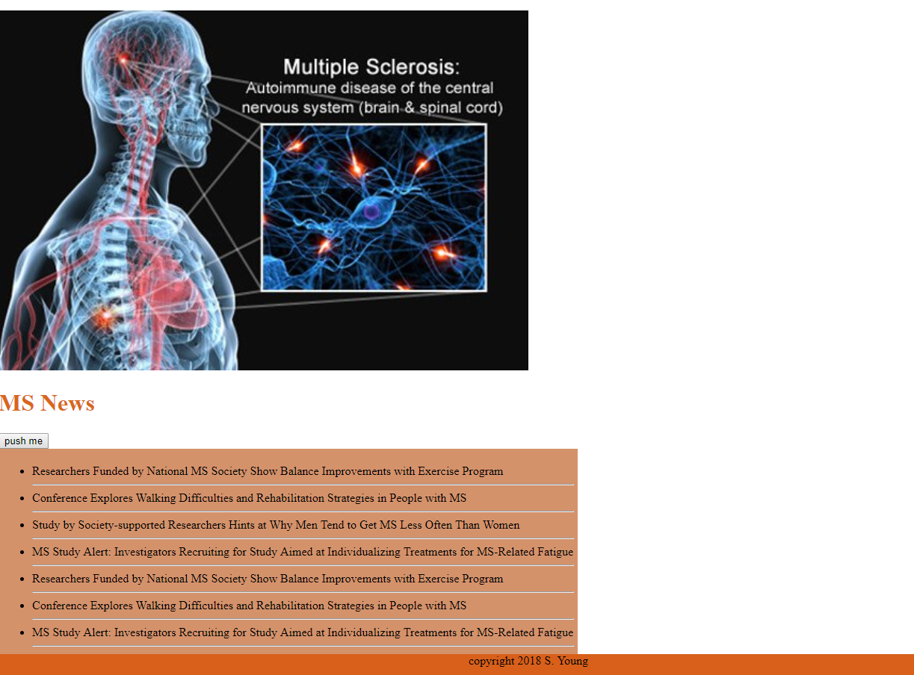

# MS News
A web app that lets users view and leave comments on the latest news about multiple sclerosis. The app uses scrapping to grab news from the National Multiple Sclerosis Society.

### NPM packages used:

  1. [body-parser](https://www.npmjs.com/package/body-parser)
  2. [express](https://www.npmjs.com/package/express)
  3. [express-handlebars](https://www.npmjs.com/package/express-handlebars)
  4. [request](https://www.npmjs.com/package/request)
  5. [cheerio](https://www.npmjs.com/package/cheerio)
  6. [mongoose](https://www.npmjs.com/package/mongoose)
	7. [morgan](https://www.npmjs.com/package/morgan)
  
## Author
Sharona Young
